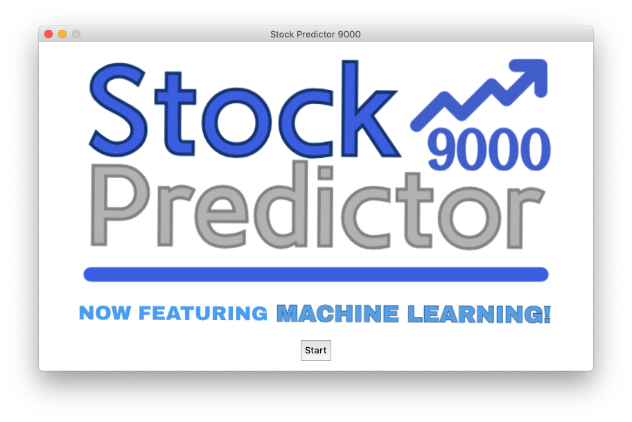
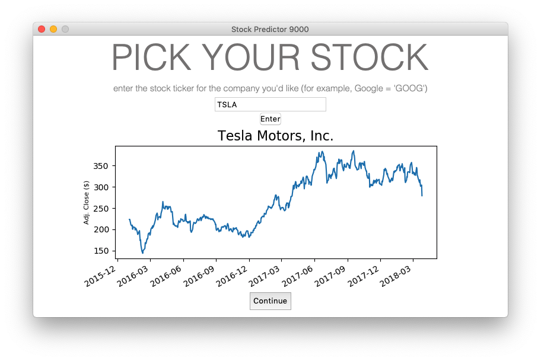
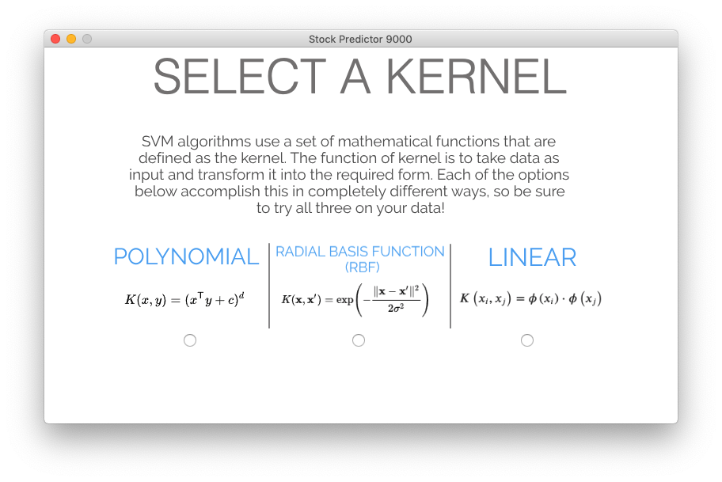
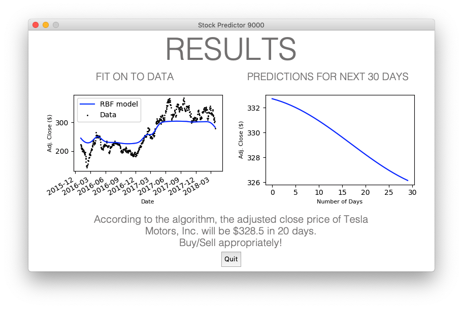

# Stock Predictor 9000
### Originally published: July 2018
Interactive machine learning-based stock prediction tool.

The tool's purpose was twofold: a learning experience of some technologies I was eager explore further - namely machine learning and UI design - as well as somewhat of an homage to my younger self who was, at the time, very interesting in stockbroking. 

### Prerequisites

- Quandl (`pip install quandl`)
- Sci-Kit Learn (`pip install scikit-learn`)

## Usage example
- Home screen (choose stock from list of tickers)

- Once stock has been selected, Quandl provides up-to-date stock information.

- After an quick explanation of the Support Vector Machine (SVM) algorithm, the user is asked to choose which kernel they'd like. 

- The result. User is also allowed to experiment with the price prediction on a specific day. 

## Authors

* **Ameen Ahmed** - [ameen-a](https://github.com/ameen-a)

## License

This project is licensed under the MIT License - see the [LICENSE.md](LICENSE.md) file for details

## TODO:
- Give the user feedback on the fit of their model (detect over/underfitting)
- Refactor code using OOP
- Port to a more modern Python GUI framework, such as PyQT
- Allow the user to apply a selection of contemplorary ML algorithms to existing data and compare their performance
- Add a 'tips' section detailing overfitting and how to avoid it.

